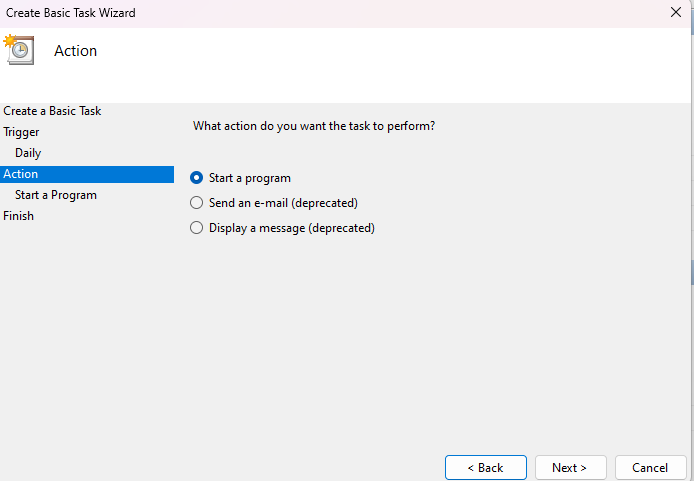
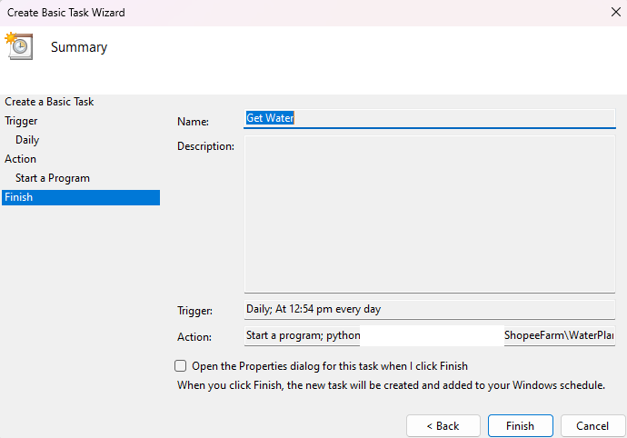

# ⚠️Use at your own risk!⚠️
**It is against Shopee Singapore Tos for using bots**
> (k) access the Shopee platform, open a user account, or otherwise access your user account using any non-official Shopee hardware or software, including but not limited to an emulator, simulator, bot or other similar hardware or software;
# Shopee Helper
🤑Automatically get your shopee coins and have your plants watered automatically!💧

# Usage
### Setup
1. Install selenium, requests, and pycryptodome. (Using [requirements.bat](./requirements.bat) or *pip*)
2. Run `python source/get-shopee-coins.pyw` from `Terminal/CMD` and complete login process.
3. Run `python source/WaterPlant.pyw` from `Terminal/CMD` and complete login process.(or run it once to generate key and copy Credentials & Cookies from GSC folder) 

### Get coins! (With 2 options)
&nbsp;&nbsp;&nbsp;&nbsp;Option 1. Run `python source/get-shopee-coins.pyw` from `Terminal/CMD` to get coins. \
&nbsp;&nbsp;&nbsp;&nbsp;Option 2. Use Windows Task Scheduler to run `python source/get-shopee-coins.pyw` periodically. \
&nbsp;&nbsp;&nbsp;&nbsp;&nbsp;&nbsp;&nbsp;&nbsp; \
&nbsp;&nbsp;&nbsp;&nbsp;&nbsp;&nbsp;&nbsp;&nbsp;

### Get Water! (With 2 options)
&nbsp;&nbsp;&nbsp;&nbsp;Option 1. Run `python source/WaterPlant.pyw` from `Terminal/CMD` to get water. \
&nbsp;&nbsp;&nbsp;&nbsp;Option 2. Use Windows Task Scheduler to run `python source/WaterPlant.pyw` periodically. \ 
&nbsp;&nbsp;&nbsp;&nbsp; \
&nbsp;&nbsp;&nbsp;&nbsp; \
&nbsp;&nbsp;&nbsp;&nbsp; \
&nbsp;&nbsp;&nbsp;&nbsp; \
&nbsp;&nbsp;&nbsp;&nbsp; \
&nbsp;&nbsp;&nbsp;&nbsp; \
&nbsp;&nbsp;&nbsp;&nbsp;

### Insert users
1. In `%HOMEPATH%/Documents/GSC/users.txt` or  `%HOMEPATH%/Documents/ShopeeFarm/users.txt`, enter new line and new username.
2. Run `python source/get-shopee-coins.pyw` or `python source/WaterPlant.pyw` from `Terminal/CMD` and complete login process.

### Notes
1. **Google Chrome must be installed first.**
2. You can check the title of login page to know which user you login to.
3. Do NOT refresh or go to previous page during login process. If you did, restart the program.
4. If you changed your password, delete %HOMEPATH%/Documents/GSC/credentials-username or %HOMEPATH%/Documents/ShopeeFarm/credentials-username and complete login process.

# Disclaimer
**Your login credentials is stored in %HOMEPATH%/Documents/GSC/credentials-username or/and %HOMEPATH%/Documents/ShopeeFarm/credentials-username and encrypted using AES.** \
**We use it to re-login after cookies expired. We do NOT steal any info about it or use it for any other purpose.**

# Test Environment
+ Windows 11 22H2
+ Python 3.8.10

# Package Requirements
+ selenium==4.1.0
+ requests==2.26.0
+ pycryptodome==3.12.0

# License
This project is under the [MIT License](./LICENSE).
